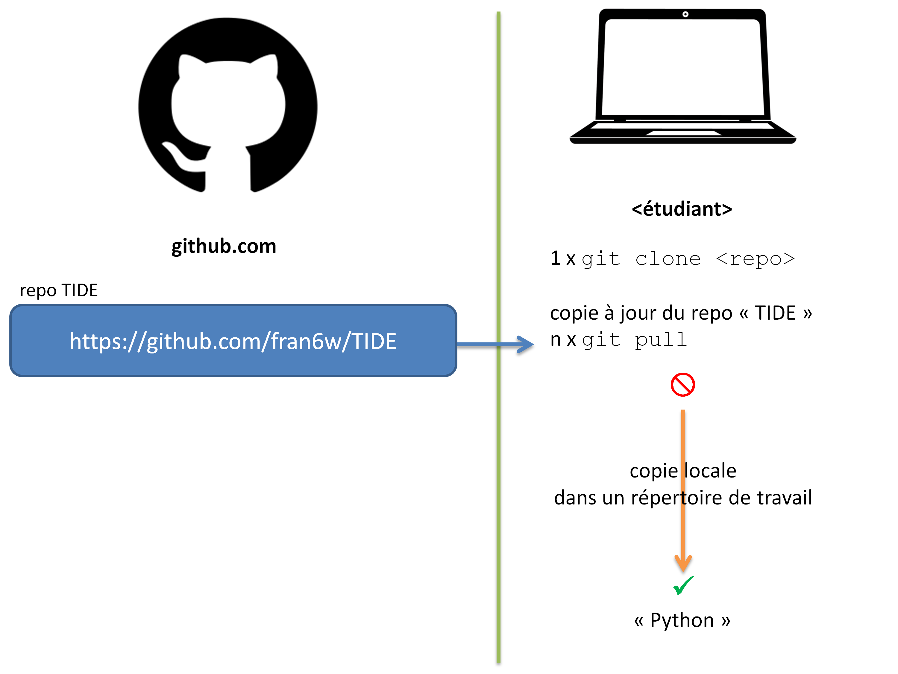

## Master Pro TIDE : Conférences Python

Francis Wolinski
- Consultant scientifique indépendant depuis 2013
- Intervenant dans le Master TIDE depuis 2015
- Test de git

### Organisation des conférences Python
- Notebooks et jeux de données disponibles sur : https://github.com/fran6w/TIDE
- 
- utiliser **git** et **github** :
    - [git doc](https://git-scm.com/doc)
    - [git cheat sheet](https://github.github.com/training-kit/downloads/github-git-cheat-sheet.pdf)
    - [vidéo git](https://www.youtube.com/watch?v=USjZcfj8yxE)
    - [vidéo github](https://www.youtube.com/watch?v=nhNq2kIvi9s)

### Session 1 : 09/10/2025
- méthodologie **CRISP-DM**
- **pandas** : Data Analysis, Dataviz (matplotlib)
- jeu de données : `data/correspondance-code-insee-code-postal.csv`
- notebook n° 1 : `01_TIDE.ipynb`

### Session 2 : 16/10/2025
- **pandas** : Data Fusion, Data Analysis, Dataviz (matplotlib, seaborn)

### Session 3 : 23/10/2025
- **pandas** : Séries Temporelles, Dataviz (matplotlib, sparklines), Data Extraction, Stylisation des Dataframes

### Session 4 : 20/11/2025
- **NumPy** : manipulations des *ndarrays*
- **pandas**: Data Transformation

### Session 5 : 04/12/2025
- **requests**, **bs4** : Web Scraping
- **requests** : Requesting API

### Session 6 : 18/12/2025
- **plotly** : Dataviz
